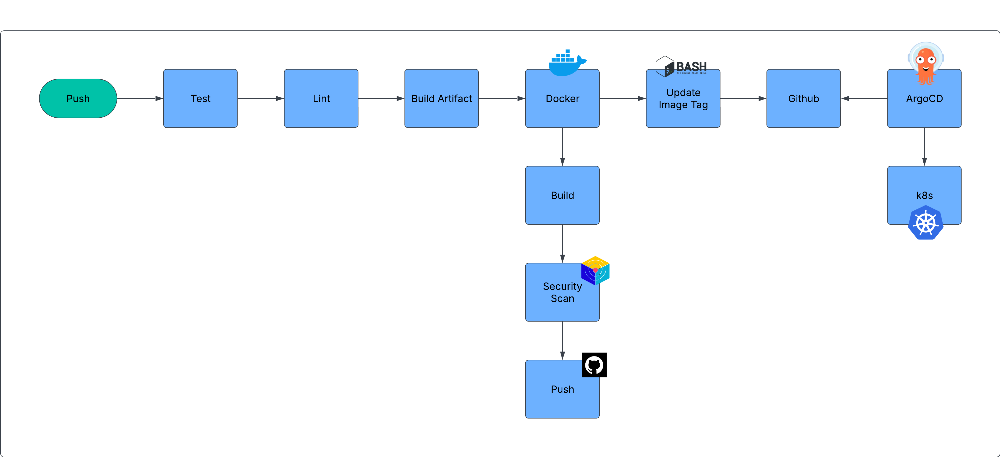
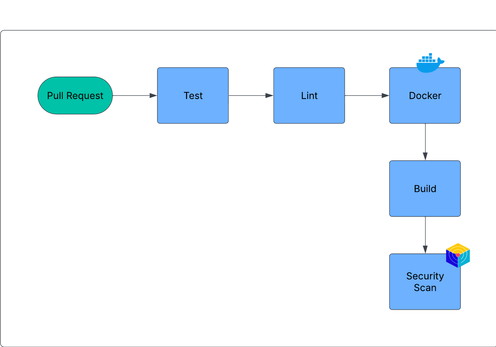

# Go Web Application – DevOps Edition


This is a DevOps-enhanced deployment of a basic Golang web application, restructured and productionized with best practices for containerization, CI/CD, observability, DevSecOps scanning, and Kubernetes deployment.

## Project Purpose

This project shows a clear DevOps career progression path:

1. Basic Go HTTP web application
2. Dockerized local development
3. Optimized Docker multi-stage production image
4. GitHub Actions CI/CD automation
5. DevSecOps scanning using Trivy, CodeQL, and Dependency Review
6. SBOM generation for software supply-chain visibility
7. Kubernetes deployment packaging using Helm
8. Observability using health, readiness, and metrics endpoints
9. Optional GenAI-style release summary for release review

## Architecture

```text
User / Browser
      |
      v
Go HTTP Server :8080
      |
      +-- /home
      +-- /courses
      +-- /about
      +-- /contact
      +-- /healthz
      +-- /readyz
      +-- /metrics

CI/CD Flow:
Developer Push -> GitHub Actions -> Test/Lint -> Docker Build -> Security Scan -> SBOM -> GHCR -> Helm/Kubernetes
```

## Technology Stack

| Area | Tools |
|---|---|
| Language | Go |
| Web Server | Go `net/http` |
| Containerization | Docker multi-stage builds |
| Local Development | Docker Compose |
| CI/CD | GitHub Actions |
| Security | CodeQL, Trivy, Dependency Review |
| Supply Chain | CycloneDX SBOM |
| Kubernetes | Helm chart |
| Observability | `/healthz`, `/readyz`, `/metrics` |
| Optional AI Ops | Offline/Bedrock-style release summary script |

## CI/CD Pipeline

This project is equipped with a DevSecOps CI/CD pipeline using GitHub Actions. The pipeline validates code quality, runs tests, builds a production Docker image, scans the repository and container image, generates SBOM artifacts, and prepares the image for Kubernetes-based delivery.

### Push Pipeline



The push pipeline represents the main release flow. After code is pushed to the main branch, the workflow runs tests, lint checks, Docker image build, Trivy security scanning, SBOM generation, and image publishing to GitHub Container Registry. The image tag can then be consumed by GitOps tools such as Argo CD for Kubernetes deployment.

### Pull Request Pipeline



The pull request pipeline is used as a validation gate before merging changes. It focuses on test execution, linting, Docker build validation, and security scanning so risky changes can be caught before they reach the main branch.

## GitHub Actions Workflow

The workflow is available under:

```text
.github/workflows/ci.yaml
```

Pipeline stages include:

- Go formatting check
- Go vet
- Unit tests with race detection and coverage
- GolangCI-Lint
- Helm lint and template validation
- Docker Buildx build
- Trivy filesystem scan
- Trivy container image scan
- CycloneDX SBOM generation
- CodeQL security analysis
- Dependency Review for pull requests
- Optional AI-style release summary artifact

## Application Endpoints

| Endpoint | Purpose |
|---|---|
| `/` | Redirects to `/home` |
| `/home` | Home page |
| `/courses` | Courses page |
| `/about` | About page |
| `/contact` | Contact page |
| `/healthz` | Liveness health check |
| `/readyz` | Readiness check |
| `/metrics` | Prometheus-style application metrics |

## Run Locally

### Option 1: Go

```bash
go test ./...
go run .
```

Open:

```text
http://localhost:8080/home
```

### Option 2: Docker Compose Development Mode

```bash
docker compose up --build
```

### Option 3: Production Container Mode

```bash
docker compose --profile prod up --build
```

## Docker Build

```bash
docker build --target prod -t go-web-app-devops:local .
docker run --rm -p 8080:8080 go-web-app-devops:local
```

The Dockerfile uses a multi-stage pattern so the final runtime image contains only the compiled Go binary and static assets. This keeps the runtime image smaller and avoids shipping build tools in production.

## Helm Deployment

Update the image repository in `helm/go-web-app-chart/values.yaml`:

```yaml
image:
  repository: ghcr.io/your-github-username/go-web-app-devops
  tag: latest
```

Then deploy:

```bash
helm lint helm/go-web-app-chart
helm template go-web-app helm/go-web-app-chart
helm install go-web-app helm/go-web-app-chart
```

## Security Improvements Added

- Non-root production container user
- Minimal production runtime image
- Security headers in the Go server
- No hardcoded secrets
- `.dockerignore` and `.gitignore` cleanup
- GitHub Actions minimal permissions
- Trivy scan and SBOM workflow
- CodeQL workflow
- Dependency Review workflow
- Helm pod security context with read-only filesystem and dropped Linux capabilities

## Optional GenAI / AI Ops Enhancement

The project includes:

```text
scripts/genai_release_summary.py
```

It generates an offline AI-style release summary from recent commits and available CI artifacts. In a real AWS environment, the same pattern can be connected to Amazon Bedrock using GitHub Actions OIDC-based AWS authentication, without storing static AWS keys in GitHub.

Run locally:

```bash
python3 scripts/genai_release_summary.py --mode offline --output release-summary.md
```

## Suggested Screenshots for GitHub

Add screenshots under `docs/images/` later:

- App running locally
- Docker Compose logs
- GitHub Actions pipeline success
- Trivy/SBOM artifact
- Helm template output
- Kubernetes pods/services if deployed

## Career Value

This project shows progression from basic application development to real DevOps delivery practices:

- Go application development
- Docker image optimization
- CI/CD automation
- DevSecOps scanning
- Kubernetes packaging
- Observability endpoints
- Supply-chain security
- AI-assisted release summary concept

## Repository Name Suggestion

```text
go-web-app-devops-portfolio
```

## License

This project uses the Apache 2.0 License.
